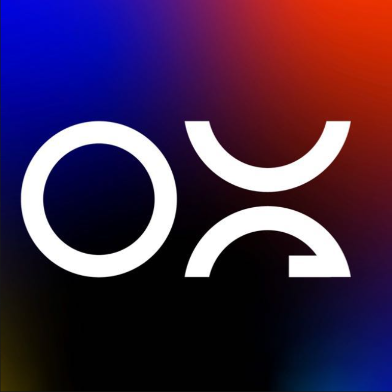

# Millennium (Incapor)

Sistema web para la gestión comercial de **Millennium** (marca **Incapor**): maestros, facturación, cobranza, reportes y dashboard operativo.

<p align="center">
  
  &nbsp;&nbsp;&nbsp;&nbsp;
  
</p>

## Colaboración

| Organización | Rol |
|--------------|-----|
| **[Ova](https://github.com/ovavisionve)** (Ova Visión) | Desarrollo y dirección técnica del proyecto |
| **Millennium** | Empresa cliente — alcance funcional y operativo del sistema |

**Desarrollador principal:** [Víctor Andrés Carrillo Barreto](https://github.com/victorx2) (`victorx2`).

**Repositorio:** [github.com/ovavisionve/Millenium](https://github.com/ovavisionve/Millenium)

---

## Enfoque (qué estamos construyendo)

Aplicación **Laravel** orientada a **cuentas por cobrar en la calle**: registro de clientes, categorías de línea (matadero/embutidos), facturas manuales con crédito, abonos con tasa y método de pago, historial y reportes filtrados (vendedor, zona, categoría, fechas). La interfaz sigue la guía operativa por pasos (maestros → facturación → cobranza → canceladas → reportes → dashboard).

---

## Versiones y stack

| Componente | Versión / notas |
|------------|-----------------|
| PHP | ^8.2 |
| Laravel | ^12 |
| Node (frontend) | Vite + Tailwind CSS 3 (PostCSS) + Alpine.js |
| Base de datos | MySQL / MariaDB (configurable en `.env`) |
| Pruebas automatizadas | PHPUnit (`php artisan test`) |

---

## Estado del proyecto (visión rápida)

**Listo o avanzado**

- [x] Autenticación, roles y usuarios activos/inactivos  
- [x] UI marca Incapor (login, navegación, componentes)  
- [x] Módulos: clientes, categorías, facturas (líneas por categoría), cobranza, canceladas, reportes  
- [x] Dashboard con métricas y gráficas (Chart.js)  
- [x] Pruebas de caja negra en login (`LoginBlackBoxTest`) — **ejecutadas en local**

**En curso / local**

- [ ] **Mecanismos de seguridad** (rate limit, validaciones, flujos de acceso): en **pruebas en entorno local**; falta validación en **staging/producción** con HTTPS y políticas definitivas.

**Pendiente (alto nivel)**

- [ ] Despliegue estable (servidor, `.env` de producción, HTTPS, backups)  
- [ ] Endurecer y documentar políticas de acceso para el equipo y agencias (canal privado, no en este README público)  
- [ ] CI opcional (GitHub Actions: tests en cada push)

> **Nota de seguridad:** credenciales, URLs internas y datos sensibles del negocio **no** van al repositorio; usá `.env` local y canales privados para el grupo.

---

## Arranque local

1. `composer install`  
2. Copiar `.env.example` → `.env`, configurar BD y `php artisan key:generate`  
3. `php artisan migrate`  
4. `npm install` && `npm run dev` (o `npm run build`)

```bash
php artisan test
```

## Licencia

MIT (código de la aplicación). El framework [Laravel](https://laravel.com) conserva su licencia MIT.
